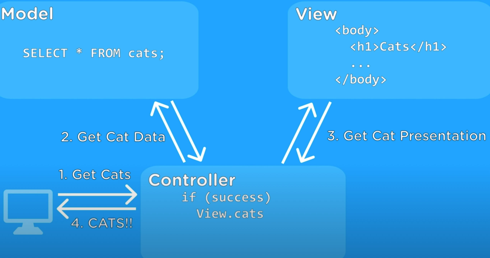

http://localhost:8080/list
https://buynow-buynow.herokuapp.com/products/list
ssl error and no pg_hba.conf entry solution https://devcenter.heroku.com/articles/connecting-heroku-postgres#heroku-postgres-ssl:~:text=Install%20the%20pg,%24

npm init (keep enter for same details)
npm install express (do always in project level)(since no intepretor) ==> node_modules folder created
npm install nodemon

folders created - models , services, controller, config, routes, DB
enviroments- development(nodemon) , production(use node server)

controllers - first layer of apis , then goes to services
services = buisness logic , it calls the db where exact squeries will execute
utils => converter, formatter, format changer, reusable things
routes => api related
dao(database)
create server.js, app.js, 
==> routes, controller, services, models,

commit -amend 
git log -p --reverse